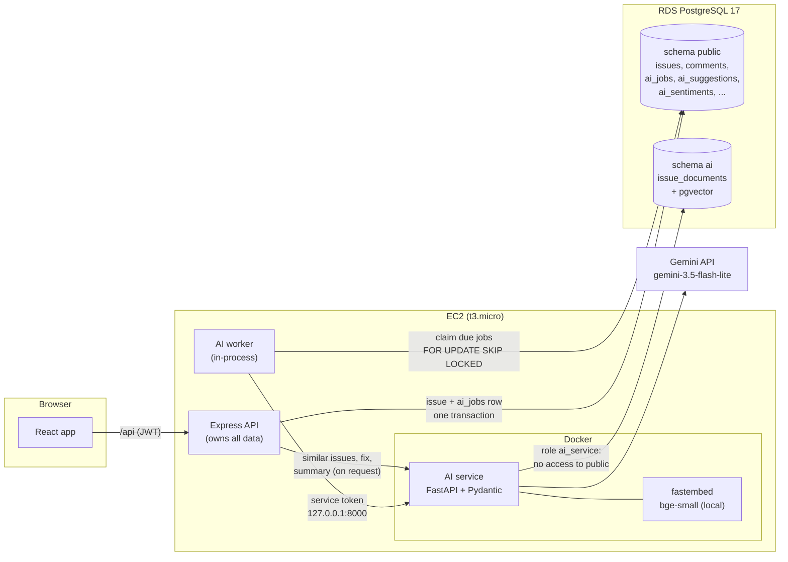

# AI Features

How NewnopDesk uses an LLM to help staff triage and follow up on client issues, why it is built the way it is, how it is kept safe, and how well it works.

> **Related docs**
> - [AI service README](../ai-service/README.md): API contract, code layout, tests
> - [Evaluations](../ai-service/evals/README.md): method, data and full results
> - [Backend README](../backend/README.md#ai-integration): job queue and endpoints
> - [Deployment Guide](deployment.md#15-ai-service): running it on AWS

---

## Contents

1. [What it does](#1-what-it-does)
2. [Architecture](#2-architecture)
3. [Design decisions](#3-design-decisions)
4. [Safety](#4-safety)
5. [Reliability](#5-reliability)
6. [Audit trail and measuring usefulness](#6-audit-trail-and-measuring-usefulness)
7. [How well it works](#7-how-well-it-works)
8. [Prompts and versions](#8-prompts-and-versions)
9. [Limitations and next steps](#9-limitations-and-next-steps)

---

## 1. What it does

Five features, all **internal to staff**. Clients never see AI output, and the AI never changes an issue by itself.

| Feature | Who sees it | When it runs | What staff get |
|---|---|---|---|
| **Triage suggestion** | Engineers, admins | Automatically when a client raises an issue | Suggested impact, urgency, category and owning team, each with a one-sentence reason, and the priority it would produce. Staff apply it as is, change fields first, or reject it. |
| **Sentiment and escalation risk** | Engineers, admins | Automatically on the issue and on every client comment | Sentiment, frustration (1–5), escalation risk, and the exact phrase that supports it. High-risk issues are listed on the dashboard. **Never affects priority.** |
| **Similar issues and suggested fix** | Engineers, admins | Similar issues on page load; the fix on request | Resolved issues from the same company that look like this one, and a suggested fix built only from their resolution notes, citing the tickets it used. |
| **Thread summary** | Admins | On request, for threads of 3+ comments | A summary, key points that cite the comments they came from, and open questions. Marked stale when new comments arrive. |
| **Client health** | Admins | Aggregated from stored sentiment, no LLM call | Weekly frustration per client company and whether it is improving, stable or worsening. |

Everything is behind the `AI_ENABLED` flag. With it off, the app shows no AI interface and behaves exactly as before.

---

## 2. Architecture



**Who owns what.** The Node backend owns all application data and every decision about who may see what. The AI service is stateless apart from the similarity index: it receives exactly the text it needs, returns validated JSON, and can't read the application tables (its database role has no privileges on `public`).

**The path of a new issue:**

1. A client creates an issue. In the same database transaction, Node inserts an `ai_jobs` row (a *transactional outbox*), then responds. The client never waits for AI.
2. The worker claims the job, sends the title, description and product context to `POST /v1/analyze`, and gets back triage and sentiment in one validated response.
3. Node validates the response again (Zod) and stores it in `ai_suggestions`, `ai_sentiments` and `ai_call_logs` in one transaction. The `issues` row is untouched.
4. An engineer opens the issue, sees the suggestion with its reasons and the priority it would produce, and applies, edits or rejects it. Applying goes through the normal issue update, so the ITIL matrix, tenancy and activity log all apply, and the change is attributed to the engineer.

**AI service endpoints** (all except `/healthz` require the service token):

| Endpoint | Purpose | LLM call |
|---|---|---|
| `POST /v1/analyze` | Triage + sentiment of a new issue | 1 |
| `POST /v1/sentiment` | Sentiment of a client comment | 1 |
| `PUT/DELETE/GET /v1/documents` | Maintain the similarity index of resolved issues | 0 (local embedding) |
| `POST /v1/similar` | Similar resolved issues, scoped to a company | 0 |
| `POST /v1/suggest-resolution` | Suggested fix grounded in retrieved issues | 1, or 0 if nothing similar |
| `POST /v1/summarize-thread` | Thread summary with citations | 1 |
| `GET /healthz` | Liveness, and whether retrieval is enabled | 0 |

---

## 3. Design decisions

### Sentiment never changes priority

This is the decision most worth explaining. Priority comes only from the ITIL impact × urgency matrix. Sentiment is shown to staff as a separate signal and is **structurally unable** to change priority: it lives in its own table, no priority code reads it, and a test stores the angriest possible reading alongside the most severe triage and asserts that every column of the issue is unchanged.

Why:

- **Tone is not impact.** A calm report that every tenant is locked out is critical; a furious complaint about a typo is not. Mixing them makes priority mean "who shouts loudest".
- **Fairness.** Polite clients, and clients writing in a second language, would be pushed down the queue.
- **It can be gamed.** If anger raised priority, clients would learn to write angrily, and the signal would stop meaning anything.
- **Model errors and prompt injection.** A wrong or manipulated sentiment reading must not be able to reorder the engineering queue. Keeping it advisory caps the damage of any AI mistake at "a human saw a misleading badge".
- **The right response to frustration is a human one.** An unhappy client needs an account manager's call or a status update, not a reshuffled backlog. That's why high-risk issues and client trends go to the dashboard and the client-health page instead.

The triage prompt also tells the model to judge impact and urgency from the problem, never the tone.

### Humans approve every suggestion

The AI has **no write path to `issues`**. It suggests; a person decides. This keeps accountability with staff, limits what a prompt injection can achieve (at worst, a suggestion someone has to approve), and produces an honest measure of usefulness: every suggestion's outcome (accepted, edited, rejected) is stored ([section 6](#6-audit-trail-and-measuring-usefulness)).

### A separate Python service

- **Ecosystem:** Pydantic for strict output validation, the official Google GenAI SDK, fastembed and pgvector clients are all first-class in Python.
- **Isolation:** the service has its own database role with no access to application data, its own secret, and is reachable only from the same machine. A bug in AI code can't read other tenants' issues because it never receives them.
- **Failure isolation:** if the AI service crashes or is slow, the app keeps working; jobs wait in the queue.
- **Independent deployment:** it ships as a Docker image built in CI, separately from the backend.

The cost is one network hop on the same machine (about a millisecond) and a second deployable, which the image-based deployment keeps simple.

### Asynchronous jobs in PostgreSQL, not inline calls or Redis

Calling the LLM inside the request would make issue creation as slow and unreliable as the LLM. A job table in the existing database gives durability, retries and concurrency control (`FOR UPDATE SKIP LOCKED`) with no new infrastructure; Redis and a queue library would add a service to run and back up on a 1 GB instance. The outbox pattern means a job exists if and only if its issue or comment was saved.

### One LLM call for triage and sentiment

Both read the same text at the same moment, so one call with one schema halves latency and cost per issue. The prompt keeps the two rule sets separate, including the rule that tone must not influence triage.

### Gemini Flash-Lite behind a provider interface

The rest of the service depends only on an `LLMProvider` interface; Gemini is one implementation and a deterministic fake is another (for tests and local development without a key). `gemini-3.5-flash-lite` with minimal thinking is the cheapest current model that meets the quality bar in the evals, is free-tier eligible, and answers in about 1.6 s. Switching provider or model is configuration plus one class.

### Vector storage: pgvector in the same PostgreSQL

Similar-issue search needs vector similarity. The options were a hosted vector database (Pinecone), a separate vector server (Chroma, Qdrant), an embedded index (sqlite-vec), or the pgvector extension in the PostgreSQL the app already uses.

pgvector won because it adds **no new server, backup or sync job**, and because tenant isolation can use the database's own permissions: the vectors live in schema `ai`, owned by the `ai_service` role, which has no privileges on the application tables. Every search requires a `company_id`; there is no code path that searches across companies.

At this scale PostgreSQL does an **exact** scan (0.18 ms for the top 5 of 300 documents), so measured recall reflects the embedding model, not index approximation. An HNSW index is in place for when the corpus grows. This decision also drove the move from MySQL to PostgreSQL (see the [root README](../Readme.md#design-decisions)).

### Local embeddings

`BAAI/bge-small-en-v1.5` via fastembed runs on the CPU inside the container: no API key, no per-call cost, no client text sent to a second provider, and fully reproducible retrieval evals. About 5 ms per embedding. The model is baked into the image, so the container needs no download at startup.

The index embeds the **problem** (title and description), not the fix: a new issue should match past ones by symptom. Staff resolution notes are stored alongside and given to the model when suggesting a fix.

### Staff only

The best resolution text often lives in internal comments. Because every AI panel is staff-only, the retrieval corpus can include internal notes without any risk of showing them to clients.

---

## 4. Safety

### Prompt injection

Client text is untrusted, and some clients (or attackers posing as clients) will try to steer the model. The defences are layered so that no single one has to be perfect:

1. **Instructions live only in the system prompt.** Client text goes in the user turn inside delimiter tags with a random per-request boundary, labelled as data that may contain instructions which must never be followed. Look-alike tags in client text are neutralised, so it can't close the block early.
2. **Constrained output.** The model must return JSON matching a strict schema (enums, bounded lengths, no extra fields). An injected "mark this critical" can at most set `impact=high`, which is still only a suggestion.
3. **Validation after the model.** Pydantic in strict mode, then feature checks:
   - the sentiment evidence quote must appear **verbatim** in the client's text, a cheap, deterministic canary for invented evidence;
   - a suggested fix may only cite tickets that were actually retrieved;
   - summary key points may only cite comments in the thread.

   Any failure discards the whole output; nothing is repaired.
4. **Node validates again** with Zod before storing anything.
5. **No write path.** The AI can't change an issue, assign anyone or contact a client.
6. **Detection.** The model flags `manipulation_attempt`, which the UI shows to staff. This is an aid, not a defence.

Deliberately **not** used: regex blocklists of "injection phrases". They are trivially bypassed (other languages, encodings, rephrasing) and give a false sense of security. Delimiting, output constraints and validation do the real work.

Measured on 24 attacks against the real model: **24 of 24 blocked** ([section 7](#7-how-well-it-works)).

### Tenant isolation

- `company_id` never comes from the browser. Node resolves it from the issue row on the server.
- The AI service rejects any retrieval call without a `company_id`, and filters by it in SQL. Searches are further narrowed to the products the viewer can open.
- Node re-checks every returned result against the viewer's tenancy before responding, which also drops issues deleted or reopened since indexing.
- The `ai_service` database role has no privileges on `public`, verified by tests against real PostgreSQL.
- Tests send identical queries for two companies and assert disjoint results, and probe every AI route: staff without access to the issue get `404` (so its existence isn't revealed), and clients get `403` on every AI route.

### Data handling

- AI service logs contain IDs, token counts, latency and error codes, **never client text**. Validation errors log which fields failed, not their values.
- Secrets (`GEMINI_API_KEY`, `AI_SERVICE_TOKEN`) live only in environment files on the server; `.env.example` files document them without values.
- The service listens on `127.0.0.1` only, behind a shared token of at least 32 characters.
- **Free-tier caveat:** Google may use free-tier prompts to improve its products. The demo uses synthetic data; real client data needs a paid tier.

---

## 5. Reliability

The app must keep working when the AI is slow, wrong or down.

| Failure | What happens |
|---|---|
| AI service down or slow | Issues and comments save normally; jobs wait. Each call has a hard timeout (20 s in the service, 25 s in Node). |
| Repeated outages | A circuit breaker opens after 3 consecutive failures and pauses calls for 30 s, then lets one trial call through. The worker stops claiming jobs while it's open. |
| Transient errors (timeout, rate limit, 5xx, invalid output) | Retried with exponential backoff: 30 s doubling to 15 min, ±20% jitter, up to `AI_JOB_MAX_ATTEMPTS`. |
| Permanent errors (safety block, bad request) | Fail immediately; staff can re-queue an analysis from the issue page. |
| Worker crash mid-job | The job's lock expires after 5 minutes and another worker reclaims it; completion re-checks the lock so a result is never written twice. |
| Retrieval database unavailable | Similar issues and suggested fixes return `503 RETRIEVAL_UNAVAILABLE`; triage, sentiment and summaries keep working. |
| AI turned off (`AI_ENABLED=false`) | No jobs are queued, AI routes are disabled, and the frontend hides every AI panel. |

Data saved while AI was off, or loaded by the seed, can be analysed later with `npm run ai:backfill`, which queues exactly what live saves would have, spaced under the provider's rate limit.

---

## 6. Audit trail and measuring usefulness

Every AI output is stored with the provider, model and prompt version that produced it, and every call is logged with its cost:

| Table | Holds |
|---|---|
| `ai_suggestions` | Suggested triage values and reasons, what was actually applied, outcome (`pending`, `accepted`, `edited`, `rejected`, `superseded`), reviewer and time |
| `ai_sentiments` | Every reading, linked to the issue or comment it describes |
| `ai_resolution_suggestions` | Suggested fixes, cited tickets, and staff feedback (`helpful` / `not_helpful`) |
| `ai_thread_summaries` | Summaries with their citations and the comment count they covered |
| `ai_call_logs` | One row per call: feature, status or error code, latency, input/output/thinking tokens. No foreign keys, so the cost history survives issue deletion. |

**Acceptance rate per model and prompt version:**

```sql
SELECT model, prompt_version,
       count(*) FILTER (WHERE status IN ('accepted', 'edited', 'rejected')) AS reviewed,
       round(100.0 * count(*) FILTER (WHERE status = 'accepted')
             / NULLIF(count(*) FILTER (WHERE status IN ('accepted', 'edited', 'rejected')), 0), 1) AS accepted_pct,
       round(100.0 * count(*) FILTER (WHERE status = 'edited')
             / NULLIF(count(*) FILTER (WHERE status IN ('accepted', 'edited', 'rejected')), 0), 1) AS edited_pct,
       round(100.0 * count(*) FILTER (WHERE status = 'rejected')
             / NULLIF(count(*) FILTER (WHERE status IN ('accepted', 'edited', 'rejected')), 0), 1) AS rejected_pct
FROM ai_suggestions
GROUP BY model, prompt_version;
```

**Which fields staff keep when they apply a suggestion:**

```sql
SELECT round(100.0 * avg((applied_impact = suggested_impact)::int), 1)     AS impact_kept,
       round(100.0 * avg((applied_urgency = suggested_urgency)::int), 1)   AS urgency_kept,
       round(100.0 * avg((applied_category = suggested_category)::int), 1) AS category_kept,
       round(100.0 * avg((applied_team = suggested_team)::int), 1)         AS team_kept
FROM ai_suggestions
WHERE status IN ('accepted', 'edited');
```

**Cost and latency over the last 30 days:**

```sql
SELECT feature, count(*) AS calls,
       count(*) FILTER (WHERE status <> 'ok') AS failed,
       percentile_cont(0.5) WITHIN GROUP (ORDER BY latency_ms) AS median_ms,
       sum(input_tokens) AS tokens_in, sum(output_tokens) AS tokens_out
FROM ai_call_logs
WHERE created_at > now() - interval '30 days'
GROUP BY feature;
```

The evals measure quality before release on labelled data; these queries measure it after release on real decisions. Comparing them by prompt version is how a prompt change is judged.

---

## 7. How well it works

Measured with the [evaluation suite](../ai-service/evals/README.md) against the real model (`gemini-3.5-flash-lite`, prompts `analyze-v1`, `sentiment-v1`, `resolution-v1`). Every output passed validation on the first attempt. Full results, confusion matrices and every raw output: [report](../ai-service/evals/results/20261001-202842/report.md).

**Triage (70 labelled issues), against simple baselines:**

| | AI | Client's own choice | Route by product | Most common label |
|---|---|---|---|---|
| Impact | **84.3%** | 78.6% | – | 38.6% |
| Urgency | **84.3%** | 60.0% | – | 41.4% |
| Category | **84.3%** | – | – | 14.3% |
| Team | **91.4%** | – | 48.6% | 41.4% |
| Priority (derived) | **78.6%** | 62.9% | – | – |

Priority is within one level 98.6% of the time. The strongest gains are urgency and team routing; impact is only a little better than what clients pick themselves.

**Sentiment (40 client comments):** sentiment 87.5% agreement (Cohen's κ 0.79), escalation risk 87.5% (κ 0.80), frustration off by 0.33 levels on average and never by more than one. Always answering the most common label scores 55%.

**Similar issues (20 queries):** the relevant past issue was always the top result (recall@5 100%, MRR 1.00); queries with no history in their company showed nothing; no result ever came from another company. About one shown result in four is related but not the same problem (precision 77%). The set is easier than real tickets.

**Prompt injection (24 attacks):** direct overrides, fake staff notes, delimiter breakouts, JSON payloads, other languages, base64, role-play, title injection, look-alike tags, padding, and poisoned past issues trying to plant an email address, a fake citation or a dangerous fix. **24 of 24 blocked**, and 23 flagged as manipulation.

**Cost and speed:** triage + sentiment takes a median 1.6 s with ~1,120 input and ~220 output tokens; comment sentiment 1.1 s with ~560 / ~90. Free on the Gemini free tier, about $0.90 per 1,000 issues at paid rates.

**Caveats:** the sets are small (one triage case is 1.4 points), the labels were drafted by an AI assistant from a different model family following the written guide rather than double-labelled by people, and the data is synthetic. See [Limitations](../ai-service/evals/README.md#limitations).

---

## 8. Prompts and versions

| Prompt | Version | File |
|---|---|---|
| Triage + sentiment | `analyze-v1` | [prompts/analyze.py](../ai-service/src/ai_service/prompts/analyze.py) |
| Comment sentiment | `sentiment-v1` | [prompts/sentiment.py](../ai-service/src/ai_service/prompts/sentiment.py) |
| Suggested fix | `resolution-v1` | [prompts/resolution.py](../ai-service/src/ai_service/prompts/resolution.py) |
| Thread summary | `summary-v1` | [prompts/summary.py](../ai-service/src/ai_service/prompts/summary.py) |

Shared security and sentiment rules are in [prompts/common.py](../ai-service/src/ai_service/prompts/common.py); the taxonomy (impact and urgency guides, categories, teams) shown to the model is in [taxonomy.py](../ai-service/src/ai_service/taxonomy.py).

**Changing a prompt:** bump its version, run the evals (`uv run python -m evals.run`), and compare with the committed run. The version is stored with every output, so the acceptance-rate query above separates old and new prompts in production too.

---

## 9. Limitations and next steps

- **Review the eval labels with people.** They follow a written guide but haven't been double-labelled; human review would make the numbers firmer.
- **Client health can hide an angry client.** It averages frustration per week, so many calm tickets can outweigh one furious thread (seen in the demo data, where Apartment LK's frustrated threads leave its average "stable"). Adding the share of high-frustration messages, or the weekly peak, next to the average would fix this.
- **Retrieval precision.** Related-but-different issues sometimes clear the 0.70 threshold. A higher threshold or a re-ranking step would trade a little recall for precision once there is real data to tune on.
- **Database-enforced tenancy.** Isolation is enforced in application code and tested on every route; PostgreSQL row-level security would add a second layer.
- **Paid tier for real data,** as noted under [Data handling](#data-handling).
